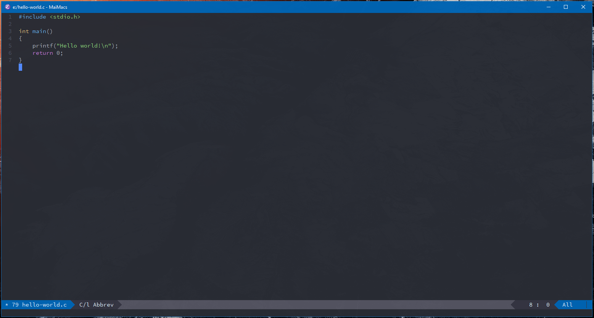
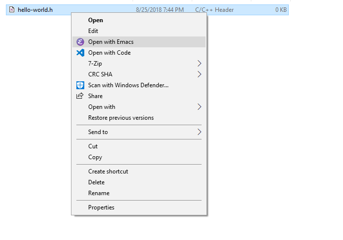

# Introduction
Emacs extensions, that useful for me, MaiHD.

## Notes
I only use emacs for structural editing Lisp code, so this extensions is simple, and have cua-mode activate by default.
Working or finding for other editor have Lisp-like structural editing.

## Features
1. Beautiful theme
2. Open with Emacs (Windows context menu)
3. C/C++ style based on Visual Studio C++
4. Header file is c++-mode by default


## Screenshots




## Installation
Create ~/.emacs.el or ~/.emacs.d/init.el (in Windows ~/ is %UserProfile%).
Run install.bat for Windows. But only used when have no .emacs.d or .emacs.el

```ELisp
(load-file "g:/projects/maimacs/init.el")
(maimacs-init "g:/projects/maimacs")
```

## Licenses
Each files or modules have each own license, see details in the header.
